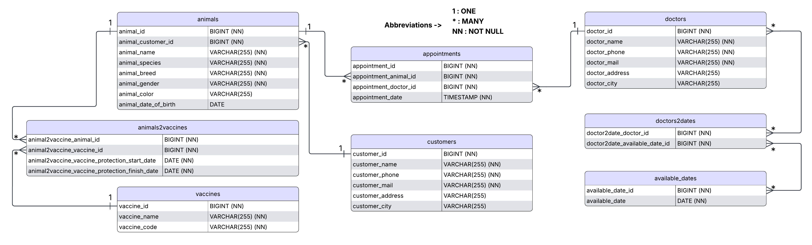

# 🐾 Vet Clinic Management System

A Java Spring Boot project for managing veterinary clinic operations including animals, doctors, appointments, vaccines,
customers, available dates, and their relationships. Built with layered architecture, DTOs, ModelMapper, and best
practices for scalability and maintainability.

---

## 📁 Project Structure

```
vet-clinic-management/
│
├── api/                     # REST controllers
├── business/                # Service layer
│   ├── abstracts/           # Service interfaces
│   └── concretes/           # Service implementations
├── core/                    # Utilities, configurations, exceptions, results
│   ├── config.modelMapper/  # ModelMapper configuration
│   ├── exception/           # Custom and global exception handling
│   ├── result/              # API response structures
│   └── utils/               # Helper classes
├── dto/                     # Data Transfer Objects (Request & Response)
│   ├── request/
│   └── response/
├── entities/                # JPA entity classes
├── repository/              # Spring Data JPA repositories
├── resources/               # Application resources (application.properties etc.)
└── VetClinicManagementApplication.java  # Main class
```

---

## 🔧 Technologies

- **Java 21**
- **Spring Boot**
- **Spring Web**
- **Spring Data JPA**
- **Hibernate**
- **ModelMapper**
- **PostgreSQL**
- **Lombok**
- **Jakarta Validation**
- **Maven**
- **RESTful APIs**
- **Postman**
- **springdoc-openapi (Swagger integration)**

---

## 📦 Features

- Manage **Animals**, **Doctors**, **Customers (Animal Owners)**, **Appointments**, **Vaccines**, **Available Dates**, *
  *Vaccinated Animals**, **Doctor's Available Dates**
- Relationships:
    - Many-to-Many, One-to-Many, Many-to-One **JPA Relationships**
- Bidirectional mappings with lifecycle operations (`cascade`, `orphanRemoval`, and `fetch` annotations)
- Ensures database integrity by deleting related entities when a parent entity is deleted (e.g., deleting a customer
  also removes associated animals and related data)
- DTO structure with clear **Request/Response separation**
- **ModelMapper** for seamless entity-DTO conversions
- **Global and custom exception handling** mechanism providing meaningful error messages
- Validations using **Jakarta Annotations**
- Meaningful **HTTP Status Codes** for API responses
- Pagination support with cursor-based endpoints
- **Date-based** filtering (e.g., animal vaccine protection periods)
- **IoC** and **Dependency Injection (DI)** using constructor injection
- Clear separation of concerns (**Layered** Architecture)
- **UML/E-R Diagram** provided below (to be added)

## 📊 UML/E-R Diagram



---

## 🔍 Interactive API Documentation (Swagger UI)

>This project uses [SpringDoc OpenAPI (Swagger UI)](https://springdoc.org/) for interactive API documentation and testing.

You can explore and test all endpoints interactively using Swagger UI:

📎Local: [http://localhost:8080/swagger-ui/index.html](http://localhost:8080/swagger-ui/index.html)

> Make sure the application is running locally.

- Example screenshot:


Swagger automatically documents all endpoints based on controller annotations.

### How to use Swagger UI:

- Expand individual endpoints to see request and response models.
- Interactively send requests directly from the Swagger UI.
- View and copy the generated curl commands or URLs.

For static reference, see the detailed API documentation below in this README.

---

## 📚 API Endpoints

### ✅ Available Dates

- `POST /v1/available-dates`
- `GET /v1/available-dates/{id}`
- `GET /v1/available-dates?page=0&pageSize=5`
- `PUT /v1/available-dates`
- `DELETE /v1/available-dates/{id}`

### ✅ Doctors

- `POST /v1/doctors`
- `GET /v1/doctors/{id}`
- `GET /v1/doctors?page=0&pageSize=2`
- `PUT /v1/doctors`
- `DELETE /v1/doctors/{id}`
- `POST /v1/doctors/assign-date`

### ✅ Animals

- `POST /v1/animals`
- `GET /v1/animals/{id}`
- `GET /v1/animals/search?name={name}`
- `GET /v1/animals/by-customer/{customerId}`
- `GET /v1/animals/{id}/customer`
- `GET /v1/animals?page=0&pageSize=2`
- `PUT /v1/animals`
- `DELETE /v1/animals/{id}`

### ✅ Customers

- `POST /v1/customers`
- `GET /v1/customers/{id}`
- `GET /v1/customers/search?name={name}`
- `GET /v1/customers?page=0&pageSize=2`
- `PUT /v1/customers`
- `DELETE /v1/customers/{id}`

### ✅ Appointments

- `POST /v1/appointments`
- `GET /v1/appointments/{id}`
- `GET /v1/appointments/by-doctor?doctorId={id}&startDate={startDate}&endDate={endDate}`
- `GET /v1/appointments/by-animal?animalId={id}&startDate={startDate}&endDate={endDate}`
- `GET /v1/appointments?page=0&pageSize=2`
- `PUT /v1/appointments/{id}`
- `DELETE /v1/appointments/{id}`

### ✅ Animal Vaccines

- `POST /v1/animals/vaccines`
- `GET /v1/animals/vaccines/by-animal/{animalId}`
- `GET /v1/animals/vaccines/by-protection-end-date/details?start={startDate}&end={endDate}`

### ✅ Vaccines

- `POST /v1/vaccines`
- `GET /v1/vaccines/{id}`
- `GET /v1/vaccines`
- `PUT /v1/vaccines`
- `DELETE /v1/vaccines/{id}`

***(For full details and interactive documentation, refer to Swagger UI)***

---

## 🗃️ Entities Overview

- ***Doctor*** :
    - `MANY-TO-MANY` <=> `AvailableDate`
    - `ONE-TO-MANY` 1=> `Appointment`
- ***Animal*** :
    - `MANY-TO-ONE` <=1 `Customer`
    - `ONE-TO-MANY` 1=> `Appointment`
    - `ONE-TO-MANY` 1=> `AnimalVaccine`
- ***Vaccine*** :
    - `ONE-TO-MANY` 1=> `AnimalVaccine`
- ***AnimalVaccine*** :
    - Join table with additional vaccine protection date fields
- ***Appointment*** :
    - Connects `Doctor` and `Animal` with timestamp
- ***Customer*** :
    - `ONE-TO-MANY` 1=> `Animal`

---

## 🧪 Sample Validation

```java
@NotBlank(message = "Animal name cannot be blank")
private String name;

@NotNull(message = "Date of birth must be provided")
@PastOrPresent(message = "Birthdate must be past or present")
private LocalDate dateOfBirth;
```

---

## 💡 Development Tips

- Used **Postman** to test endpoints.
- Applied **DTO validation** before mapping.
- Avoided **CascadeType.REMOVE** on many-to-many relationships.
- Used **FetchType.LAZY** for collections to prevent performance issues.
- Used bidirectional `@PrePersist` if appointments/vaccines must sync both sides.

---

## 🚀 Getting Started

1. Clone the repository
2. Configure PostgreSQL credentials in `application.properties`
3. Run the project with your IDE or using:

```bash
./mvnw spring-boot:run
```

4. Use Postman or Swagger UI to test the endpoints

---

## 📜 License

MIT - © Velihan Gözek, 2025